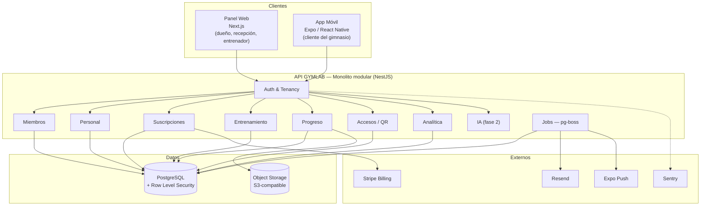

# GYMLAB — Arquitectura de referencia (v1)

> Estado: **aprobada**. Fecha: 2026-07-26.
> Contexto: SaaS B2B para gimnasios. Cliente que paga = dueño del gimnasio.
> Restricción dominante: **un solo desarrollador, asistido por IA**.

---

## 0. Principio rector

> **La mejor arquitectura no es la más escalable: es la que una sola persona puede
> entender, cambiar y arreglar un domingo por la noche, y que además no impide crecer.**

Todo lo que sigue está subordinado a esa frase. Cada vez que hubo que elegir entre
"más potente" y "menos piezas", ha ganado "menos piezas".

Corolario práctico: **una única pieza desplegable, un único lenguaje, una única base
de datos.** La complejidad distribuida prematura es la primera causa de muerte de
proyectos de un solo desarrollador.

---

## 1. Asunciones (validar antes de construir)

| # | Asunción | Impacto si es falsa |
|---|---|---|
| A1 | GYMLAB **no** mueve el dinero de las cuotas de los socios en el MVP | **Alto**. Obligaría a Stripe Connect, KYC por gimnasio, payouts, disputas |
| A2 | GYMLAB cobra su propia suscripción al gimnasio vía Stripe Billing | Bajo |
| A3 | Escala objetivo: cientos de gimnasios / decenas de miles de socios | Medio |
| A4 | Un socio pertenece a un gimnasio; multi-sede es futuro pero previsto | Medio |
| A5 | Infra < 100 €/mes, región UE | Bajo |
| A6 | El QR de acceso se valida **online** en el MVP (sin torno físico) | Medio |

---

## 2. Vista general



---

## 3. Decisiones (ADR resumidos)

### ADR-001 — Monolito modular, no microservicios

**Decisión:** una sola aplicación desplegable, dividida internamente en módulos con
fronteras explícitas.

**Por qué:**
- Un desarrollador no puede operar un sistema distribuido. Cada servicio extra añade
  despliegue, observabilidad, versionado de contratos y fallos parciales.
- El dominio de un gimnasio es **fuertemente transaccional y acoplado**: dar de alta a
  un socio toca miembro + suscripción + credencial de acceso + email. En un monolito
  eso es una transacción de base de datos. En microservicios es una saga.
- La escala prevista (A3) cabe holgadamente en una sola instancia con Postgres.

**Descartado:** microservicios (complejidad injustificada), serverless puro
(cold starts, límites de conexiones a Postgres, dificultad para jobs y transacciones largas).

**Mitigación del riesgo:** los módulos se comunican **solo** a través de sus
servicios de aplicación (nunca importando repositorios ajenos). Si algún día hay que
extraer un módulo, la costura ya existe.

---

### ADR-002 — Multi-tenancy: schema compartido + `gym_id` + Row Level Security

**Decisión:** una sola base de datos, un solo schema. Toda tabla de negocio lleva
`gym_id`. Postgres RLS impone el aislamiento a nivel de motor.

**Por qué:** es **la decisión más cara de revertir** de todo el proyecto.

| Estrategia | Aislamiento | Coste operativo | Migraciones | Veredicto |
|---|---|---|---|---|
| BD por tenant | Máximo | Prohibitivo con 200 gimnasios | N migraciones | ❌ |
| Schema por tenant | Alto | Alto (Postgres sufre con miles de schemas) | N migraciones | ❌ |
| **Schema compartido + RLS** | **Alto (a nivel de motor)** | **Mínimo** | **Una** | ✅ |

La clave que hace segura la opción barata es **RLS**: el aislamiento no depende de
que el desarrollador (o la IA) recuerde poner `WHERE gym_id = ...` en cada consulta.
Lo impone Postgres. Un olvido devuelve cero filas, no las de otro gimnasio.

**Implementación:**

```sql
ALTER TABLE members ENABLE ROW LEVEL SECURITY;
CREATE POLICY tenant_isolation ON members
  USING (gym_id = current_setting('app.gym_id', true)::uuid);
```

Cada petición HTTP abre una transacción y ejecuta
`SELECT set_config('app.gym_id', $1, true)` — el `true` la hace **local a la
transacción**, requisito imprescindible para funcionar con pooler en modo transaction.

**Defensa en profundidad:** además de RLS, la capa de repositorio inyecta `gym_id`
automáticamente. Dos cinturones, porque un fallo aquí es una filtración de datos
entre clientes y significa el fin del producto.

**Previsión multi-sede (A4):** desde el día uno existe la tabla `gyms` con
`organization_id`. Aunque en v1 sea 1:1, tener la jerarquía preparada evita una
migración dolorosa cuando llegue la primera cadena con dos sedes.

---

### ADR-003 — TypeScript de extremo a extremo

**Decisión:** un único lenguaje en API, panel web y app móvil.

**Por qué:** con un solo desarrollador, el cambio de contexto entre lenguajes es el
mayor impuesto oculto. Además permite un paquete `contracts` compartido: los tipos y
esquemas de validación (Zod) se definen **una vez** y los consumen los tres extremos.
Si cambias un campo, el compilador te dice qué pantallas se rompen — en web y en móvil.

Para desarrollo asistido por IA esto es decisivo: el modelo tiene los tipos del dominio
completo en contexto y genera código consistente en lugar de reinventar DTOs.

---

### ADR-004 — Stack concreto

| Capa | Elección | Por qué |
|---|---|---|
| API | **NestJS** | Estructura opinionada (módulos, DI). Su rigidez es una ventaja con IA: reduce la varianza del código generado |
| ORM | **Drizzle** | Control total del SQL y de la transacción — necesario para RLS. Sin motor binario aparte |
| BD | **PostgreSQL** (Neon o Supabase, región UE) | Hace de base relacional, cola de trabajos, búsqueda y analítica del MVP. Una pieza en lugar de cuatro |
| Auth | **Better Auth** | Se aloja en tu propio Postgres: sin coste por usuario activo y sin exportar datos personales a un tercero (relevante para RGPD) |
| Panel web | **Next.js (App Router)** | Renderizado híbrido, ecosistema, despliegue trivial |
| Móvil | **Expo (React Native)** | Un código para iOS y Android. **EAS Update** permite parchear sin pasar por revisión de las tiendas: crítico cuando el equipo es una persona |
| Jobs | **pg-boss** | Colas sobre Postgres. Evita añadir Redis para 4 trabajos periódicos |
| Ficheros | **S3-compatible** (R2 / Supabase Storage) | URLs firmadas de corta duración; nunca bucket público |
| Email | **Resend** | Transaccional simple |
| Push | **Expo Push** | Incluido en el stack móvil |
| Errores | **Sentry** | Con un solo dev, enterarte del fallo antes que el cliente no es opcional |
| Pagos B2B | **Stripe Billing** | Solo suscripción GYMLAB → gimnasio (A2) |
| CI/CD | **GitHub Actions** | Lint + typecheck + tests + migraciones + deploy |

**Alternativa descartada — tRPC:** máxima ergonomía de tipos, pero acopla cliente y
servidor a la misma versión. Con una app móvil en las tiendas tendrás usuarios con
versiones antiguas durante meses: necesitas **REST versionado** (`/v1/...`) y un
contrato estable. Además, REST te deja abrir integraciones y webhooks a terceros sin
rediseñar nada.

---

### ADR-005 — Monorepo

```
gymlab/
├── apps/
│   ├── api/        # NestJS — monolito modular
│   ├── web/        # Next.js — panel de gestión
│   └── mobile/     # Expo — app del cliente
├── packages/
│   ├── contracts/  # Esquemas Zod + tipos + cliente HTTP generado
│   ├── db/         # Esquema Drizzle + migraciones + políticas RLS
│   └── config/     # tsconfig, eslint, tailwind compartidos
└── docs/
    └── adr/
```

Un cambio de dominio se hace en **un commit atómico** que atraviesa API, web y móvil.
Con repos separados, el mismo cambio son tres PRs y una ventana de incoherencia.

---

### ADR-006 — Módulos del dominio

Cada módulo posee sus tablas. Nadie lee las tablas de otro: se pide al servicio.

> Actualizada tras cerrar la Fase 1. Antes describía el plan; ahora describe lo
> que hay. Tres filas no coincidían con el código, y era el documento que se lee
> para mapear el proyecto.

| Módulo | Responsabilidad | Tablas | Estado |
|---|---|---|---|
| `identity` | Usuarios, sesiones, roles, pertenencia | `users`, `memberships`, `sessions`, `verifications`, `accounts` | ✅ |
| `organization` | Organización, gimnasios y sus ajustes | `organizations`, `gyms` | ✅ |
| `members` | Socios: ficha, estado, notas internas | `members`, `member_notes`, `member_counters` | ✅ |
| `trainers` | Entrenadores y asignación de socios | `trainers`, `trainer_assignments` | ✅ |
| `billing` | Planes, cuotas y pagos registrados | `plans`, `member_subscriptions`, `payments` | ✅ |
| `training` | Ejercicios, rutinas y su asignación | `exercise_templates`, `exercises`, `routines`, `routine_items`, `routine_assignments` | ✅ |
| `progress` | Peso y medidas (**datos de salud, art. 9**) | `body_metrics` | ✅ |
| `access` | Tokens QR y registro de entradas | `access_tokens`, `access_events` | ✅ |
| `dashboard` | Métricas del panel del dueño | **ninguna** | ✅ |
| `invitations` | Invitaciones al gimnasio | `invitations` | ✅ |
| `compliance` | Consentimientos RGPD | `consents` | ✅ |
| `platform` | Facturación GYMLAB, superadmin | `gym_subscriptions` | Fase 2+ |

**Tres correcciones sobre lo que este documento decía antes**, y conviene saber
por qué cambiaron:

- **`staff` se llamó `trainers`** y sus tablas son `trainers` / `trainer_assignments`.
  Recepción no necesitó perfil propio: es un rol en `memberships`, nada más.
- **`workout_logs` no existe.** Registrar series hechas quedó fuera del MVP; lo
  que sí apareció fue `routine_items` —los ejercicios de cada rutina— y
  `exercise_templates`, el catálogo de plataforma que introdujo ADR-0012.
- **`analytics` no usa vistas materializadas.** El módulo se llama `dashboard`, no
  tiene ni una tabla y consulta en vivo: cada módulo calcula sus propias métricas
  y el panel compone. Es el único módulo sin esquema propio.

**La consecuencia que sí conviene recordar:** consultar en vivo funciona a escala
de piloto, pero la asistencia depende de `access_events`, que se purga por
retención. Los agregados históricos hay que calcularlos **antes** de esa purga.

**Regla de oro:** `training` **no** importa el repositorio de `members`. Pide
`membersService.getById()`. Es la única disciplina que hace que la extracción futura
de un módulo sea posible.

**Y ahora hay un test que lo comprueba.** Durante la Fase 1 esta regla se
incumplió en cuatro de siete módulos sin que nada se pusiera en rojo —no rompe
nada, por eso duró meses— hasta que la encontró una auditoría manual.
`fronteras.test.ts` declara qué tablas puede tocar cada módulo y falla si alguien
cruza. Una regla que solo vive en un documento es una recomendación.

**La excepción declarada:** `auth` e `invitations` sí tocan `users`, `memberships`
y `sessions`, porque `identity` no expone servicio de aplicación. Está escrita en
el propio guardarraíl para que sea una decisión vigilada y no un olvido. Cerrarla
—dándole servicio a `identity`— queda pendiente de decisión.

---

## 4. Roles y autorización

| Rol | Ámbito |
|---|---|
| `superadmin` | Plataforma. **Fuera de RLS** mediante rol de BD separado y con auditoría obligatoria |
| `owner` | Todo su gimnasio, incluida facturación |
| `receptionist` | Socios, cobros, accesos. **Sin** datos de salud ni finanzas globales |
| `trainer` | Solo sus socios asignados: rutinas y progreso |
| `member` | Solo sus propios datos |

Implementación: **RBAC con ámbito** (`rol` + `gym_id` + para entrenadores, filtro por
asignación). Guard de NestJS + política RLS. Nada de listas de permisos por usuario
en v1 — es complejidad que aún no has vendido.

Nota de privacidad: que recepción no vea peso ni medidas no es un capricho de
producto, es **minimización de datos** (RGPD art. 5.1.c).

---

## 5. Diseño del QR de acceso

Es la funcionalidad con más superficie de abuso: si se rompe, entra gente que no paga.

**Descartado:** QR estático por socio. Se fotografía y se comparte por WhatsApp en
una tarde.

**Diseño v1 (validación online):**
1. La app pide `POST /v1/access/token` → devuelve un token firmado (HMAC) con
   `{member_id, gym_id, jti, exp}` y **TTL de 60 s**.
2. La app lo pinta como QR y lo **regenera automáticamente** antes de caducar.
3. El escáner de recepción hace `POST /v1/access/verify`. El servidor comprueba firma,
   caducidad, **`jti` de un solo uso** y estado de la suscripción.
4. Respuesta semáforo: `ALLOW` / `DENY(motivo)` / `WARN(cuota vence en N días)`.
5. Todo intento se escribe en `access_events` — es el dato que alimenta el dashboard
   de asistencia, que es de lo que más presume un dueño de gimnasio.

**Preparado para v2 (offline):** firmar con **Ed25519** en lugar de HMAC. El escáner
guarda la clave pública y valida sin red — imprescindible si un día hay torno físico
o el gimnasio está en un sótano. El cambio de HMAC a Ed25519 es local al módulo
`access`; no arrastra al resto.

---

## 6. RGPD por diseño

Almacenar peso, medidas y rutinas es tratar **datos de salud** = categoría especial
(art. 9). No es opcional.

| Requisito | Implementación |
|---|---|
| Residencia del dato | Toda la infra en región **UE**. Verificar cada subencargado |
| Base legal | **Consentimiento explícito y versionado** para datos físicos, separado del contrato de servicio. Tabla `consents` con versión, timestamp e IP |
| Minimización | Recepción no accede a `progress`. Aplicado por rol **y** por RLS |
| Cifrado | TLS en tránsito; cifrado en reposo en BD y storage. Fotos de progreso **solo** por URL firmada de corta duración |
| Derecho de acceso y portabilidad | Job que genera export JSON/CSV completo del socio |
| Derecho al olvido | **Borrado real** de datos personales + anonimización de lo agregado (las métricas del dashboard sobreviven sin identificar a nadie) |
| Retención | Política explícita: socio dado de baja → purga automática a los N meses |
| Auditoría | `audit_log` append-only de todo acceso a datos de salud y de toda acción de `superadmin` |
| Encargado del tratamiento | GYMLAB es **encargado**, el gimnasio es **responsable**. Necesitas un DPA plantilla para tus clientes y registro de subencargados |

Consecuencia arquitectónica concreta: **el borrado no puede ser un `DELETE` en
cascada improvisado**. Cada módulo expone `erase(memberId)` y el módulo `identity`
los orquesta. Diseñarlo el día 1 cuesta una tarde; el día 400 cuesta una semana.

---

## 7. Despliegue y coste

```
Vercel (EU)      → Panel web
Railway/Render EU → API + workers          ~20 €
Neon / Supabase EU → PostgreSQL            ~20-25 €
Cloudflare R2     → Ficheros               ~1 €
Resend / Sentry / Expo → free tier         0 €
                                    TOTAL ≈ 45-60 €/mes
```

Entornos: `dev` (local, Docker Compose) → `staging` → `production`.

**Optimización deliberadamente pospuesta:** migrar a Hetzner + Coolify divide el coste
por cinco, pero te compra trabajo de sysadmin. Con un solo desarrollador, tu tiempo
vale mucho más que 40 €/mes. Reconsiderar solo por encima de ~300 €/mes de infra.

---

## 8. Hoja de ruta

> Este documento describe el plan. El avance real vive en
> [`00-estado.md`](00-estado.md) — **la Fase 0 está completada**.

**Fase 0 — Cimientos (semanas 1-2).** Monorepo, esquema con `gym_id`, RLS y sus tests,
auth, roles, CI. *No hay funcionalidad visible y es la fase que más deuda evita.*

**Fase 1 — MVP.** Socios · entrenadores · planes y suscripciones · rutinas · peso ·
QR · dashboard · app móvil. Objetivo: **3 gimnasios piloto en producción**.

**Fase 2 — Comercial.** Stripe Billing, onboarding self-service, notificaciones,
export RGPD, informes.

**Fase 3 — Diferenciación.** IA de fitness, dietas, comunidad, gamificación,
wearables, marca blanca.

---

## 9. Cuándo romper esta arquitectura

No por intuición. Por métrica:

| Señal medida | Acción |
|---|---|
| p95 de la API > 500 ms de forma sostenida | Índices y caché de consultas antes que tocar la arquitectura |
| CPU de Postgres > 70 % sostenido | Réplica de lectura para dashboard y analítica |
| Un gimnasio > 20 % del volumen total | Evaluar BD dedicada para ese tenant (el modelo `gym_id` ya lo permite) |
| La IA consume la mayoría del CPU o tiene latencia muy distinta | Extraer `ai` a su propio servicio — es el candidato natural, ya está aislado |
| > 3 desarrolladores pisándose | Entonces, y solo entonces, dividir por módulo |

Mientras no se cumpla ninguna, **cualquier reescritura es procrastinación disfrazada
de ingeniería**.

---

## 10. Riesgos principales

| Riesgo | Severidad | Mitigación |
|---|---|---|
| Fuga de datos entre gimnasios | **Crítica** | RLS + repositorio + **test automático obligatorio**: un tenant no ve datos de otro. Se ejecuta en cada PR |
| Fuga de datos de salud | **Crítica** | Segregación por rol, auditoría, cifrado, minimización |
| QR compartido entre socios | Alta | Token efímero de un solo uso |
| Bus factor = 1 | Alta | Documentación, ADRs, IaC, tests. Que el proyecto sobreviva a una gripe |
| Alcance que se dispara | Alta | La lista de "fuera del MVP" es un contrato contigo mismo |
| Dependencia de proveedor | Media | La lógica de negocio vive en tu API, no en el proveedor. Postgres estándar, storage S3-compatible |
